# Project description

A learning project to learn about switching power supplies.The Buck chip is a TPS5430DDA.

# Design software

KiCAD v6.0.2

# Circuit performance

## version 1.2

- Fixed the feedback trace under output filter capacitor.

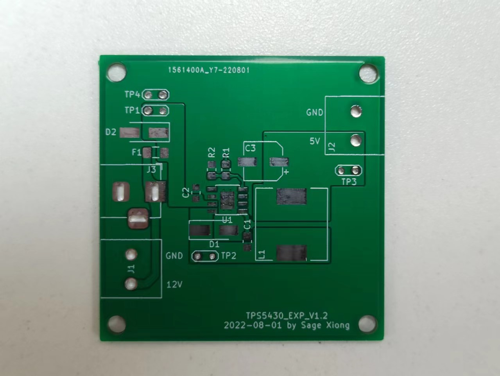

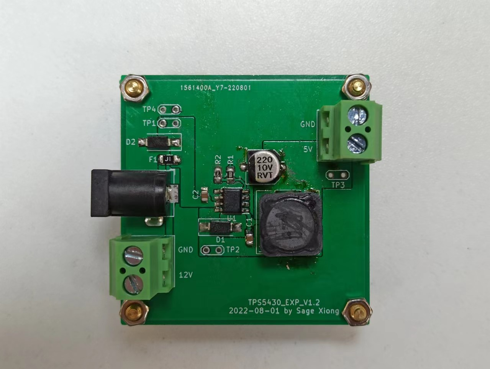

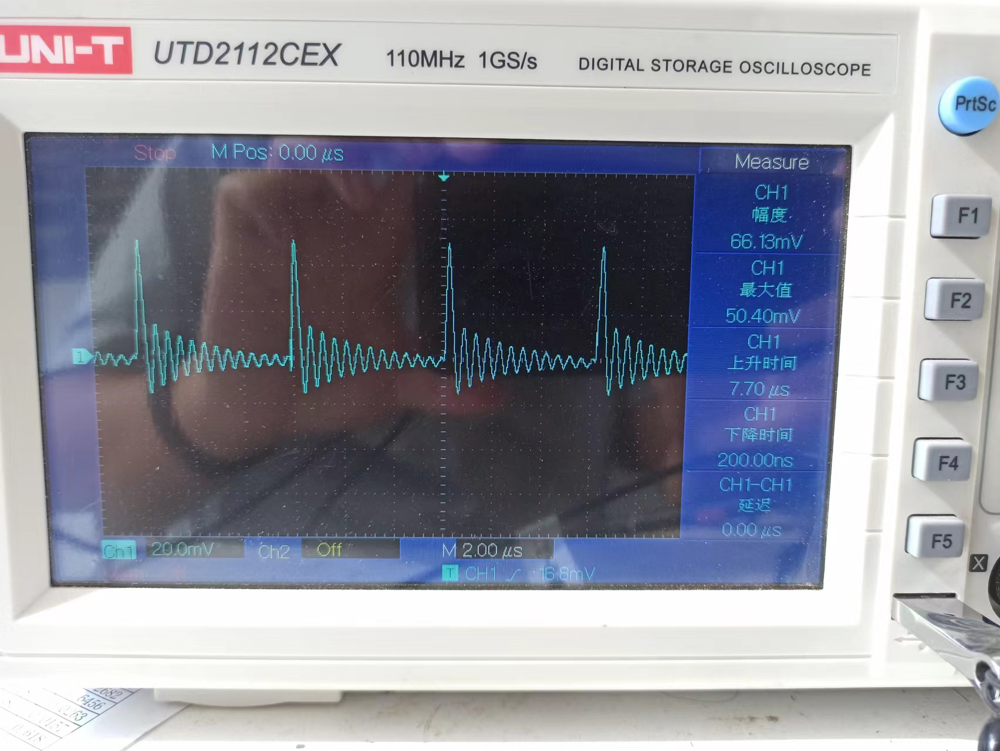

## version 1.1

- Finished the First version layout.

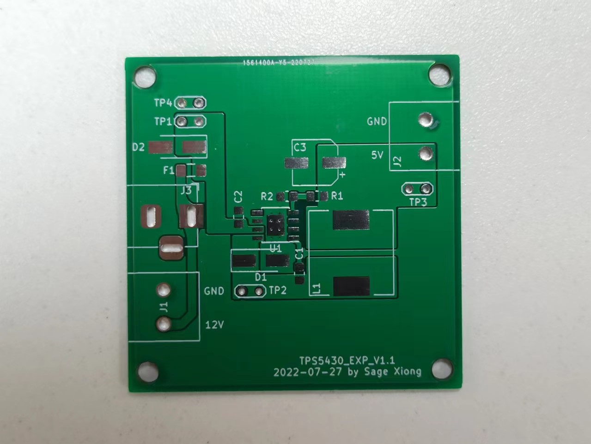

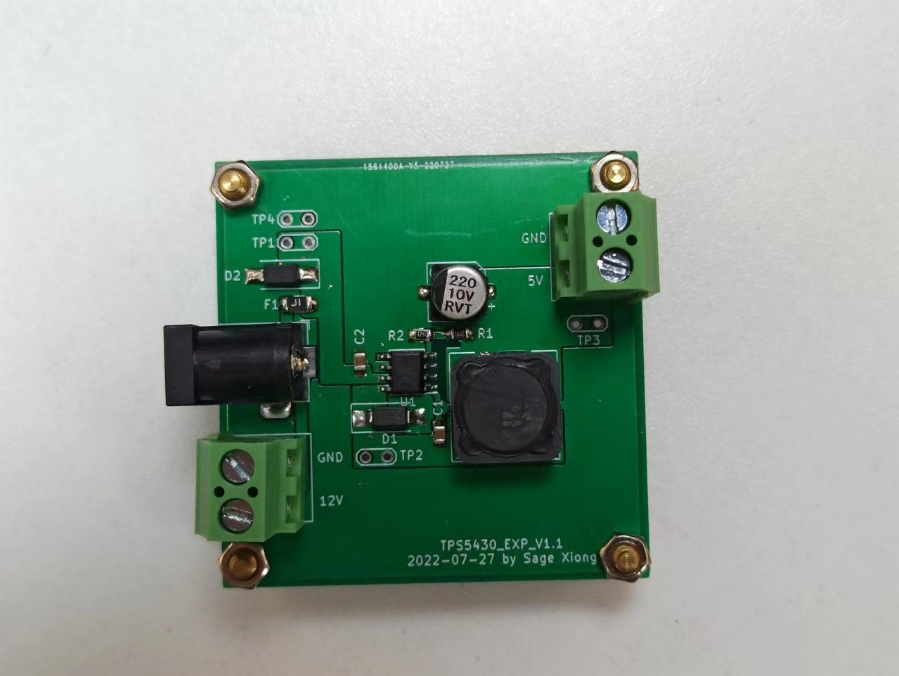

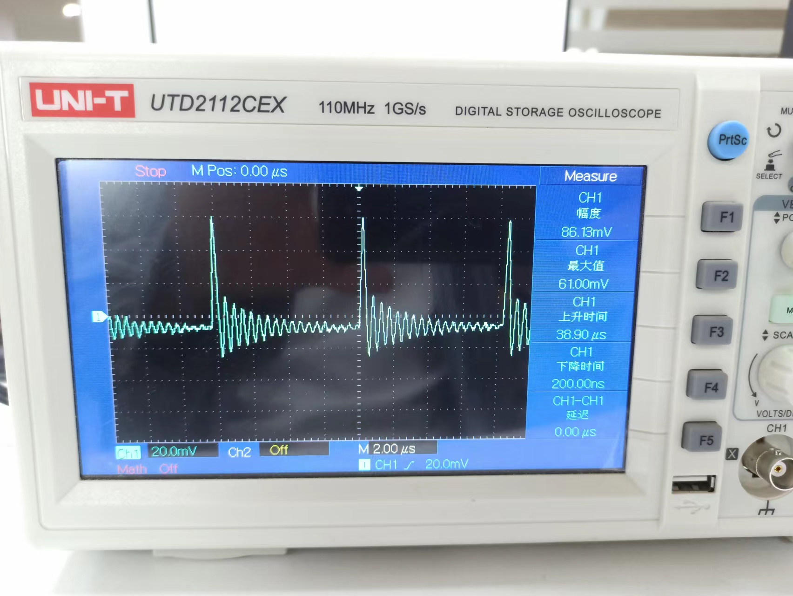

## version 1.4

- For the input, an input filter capacitor is added;
- For the output, a tantalum capacitor and an MLCC are added for filtering;
- Change the fixed output to an adjustable output;

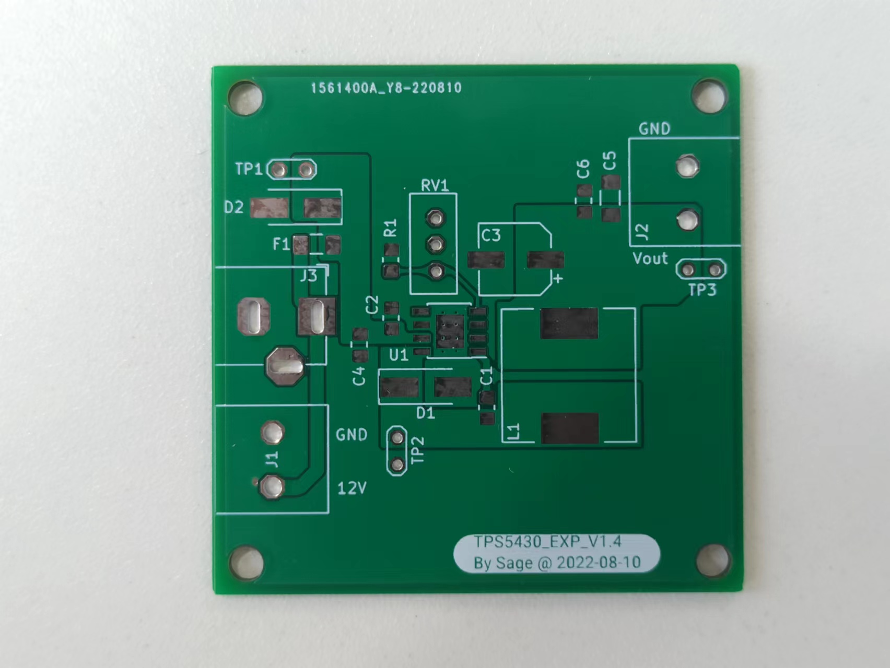

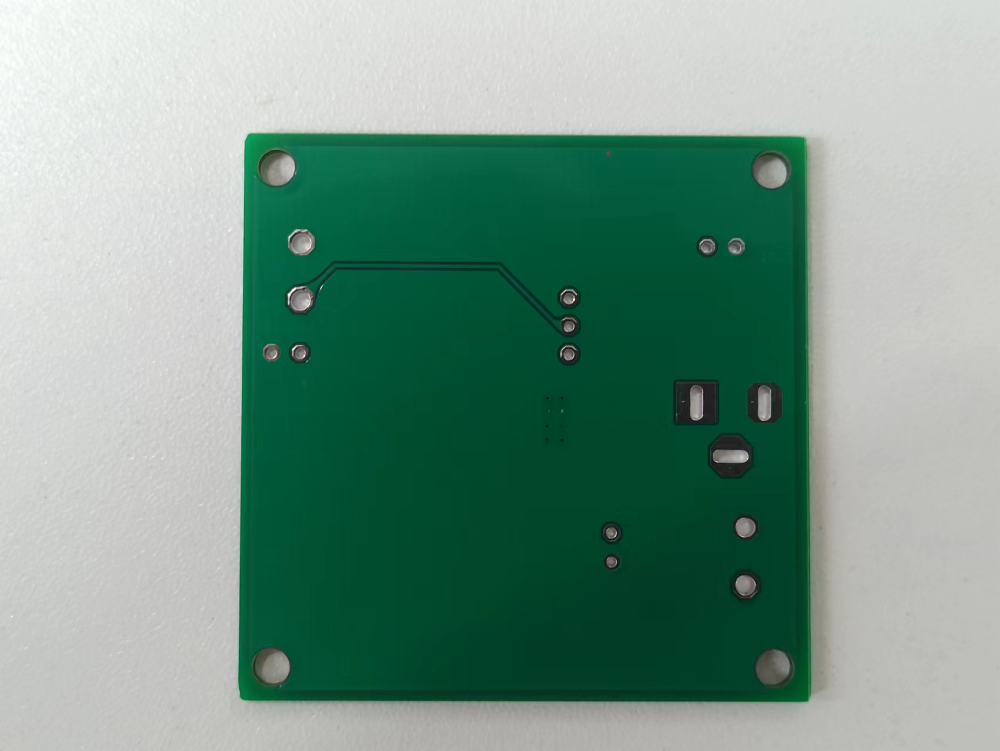

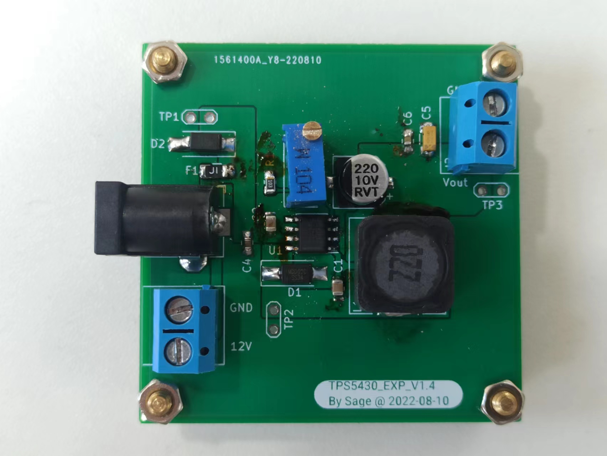

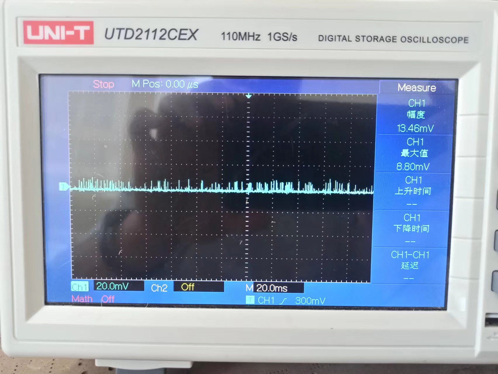

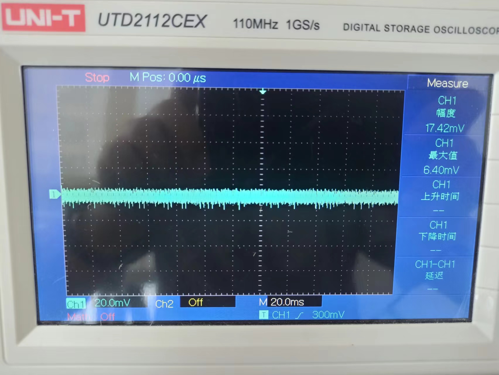