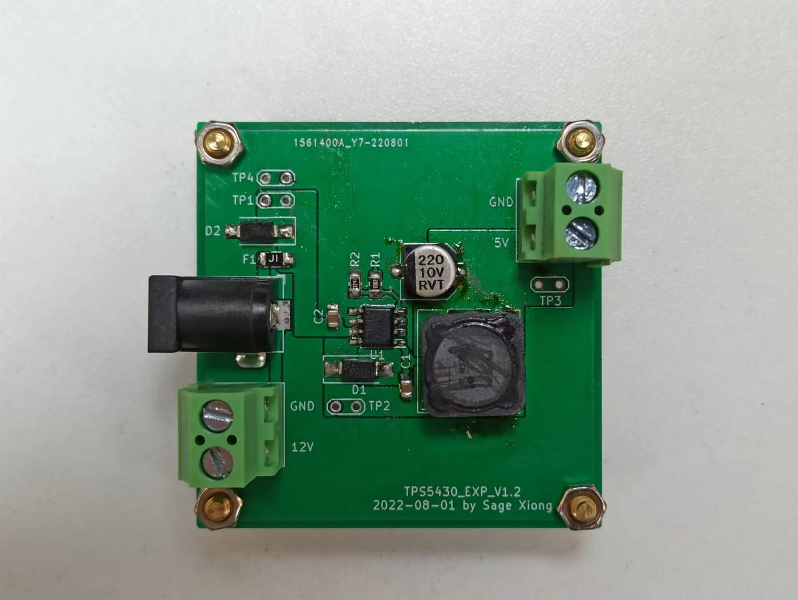
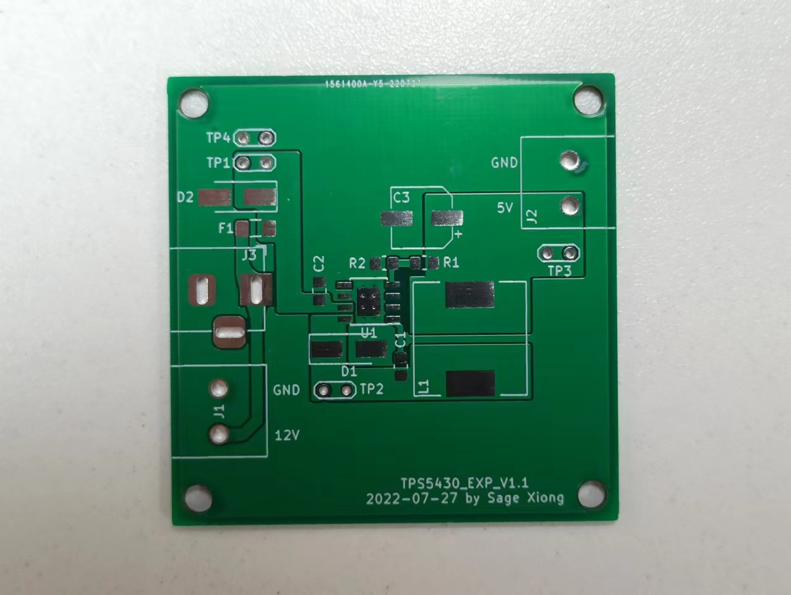
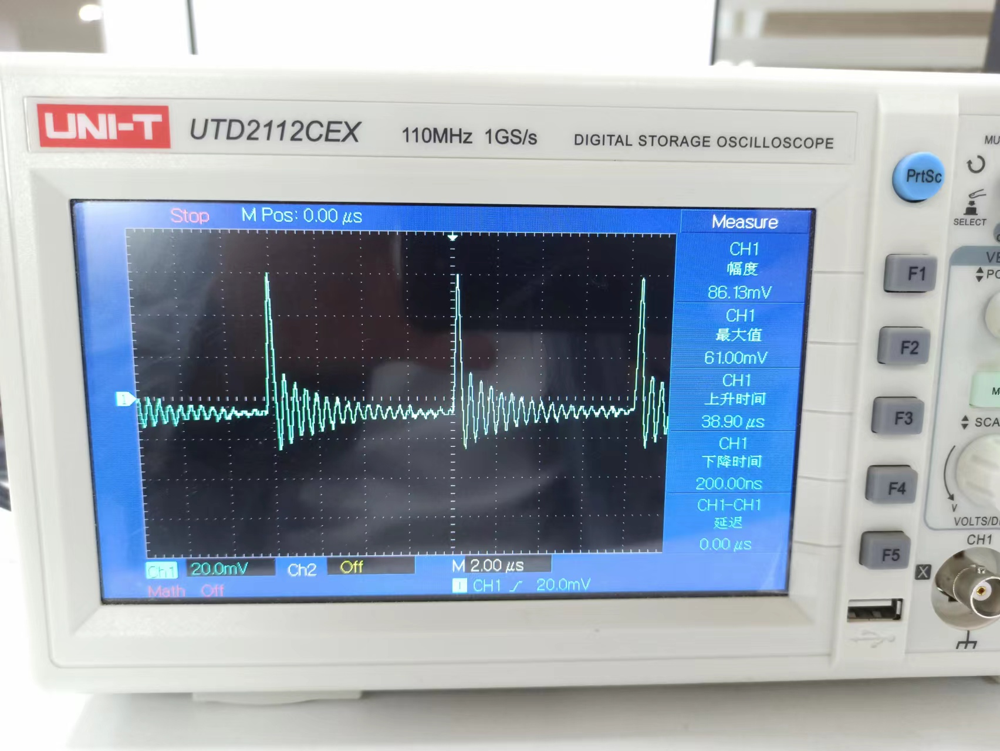
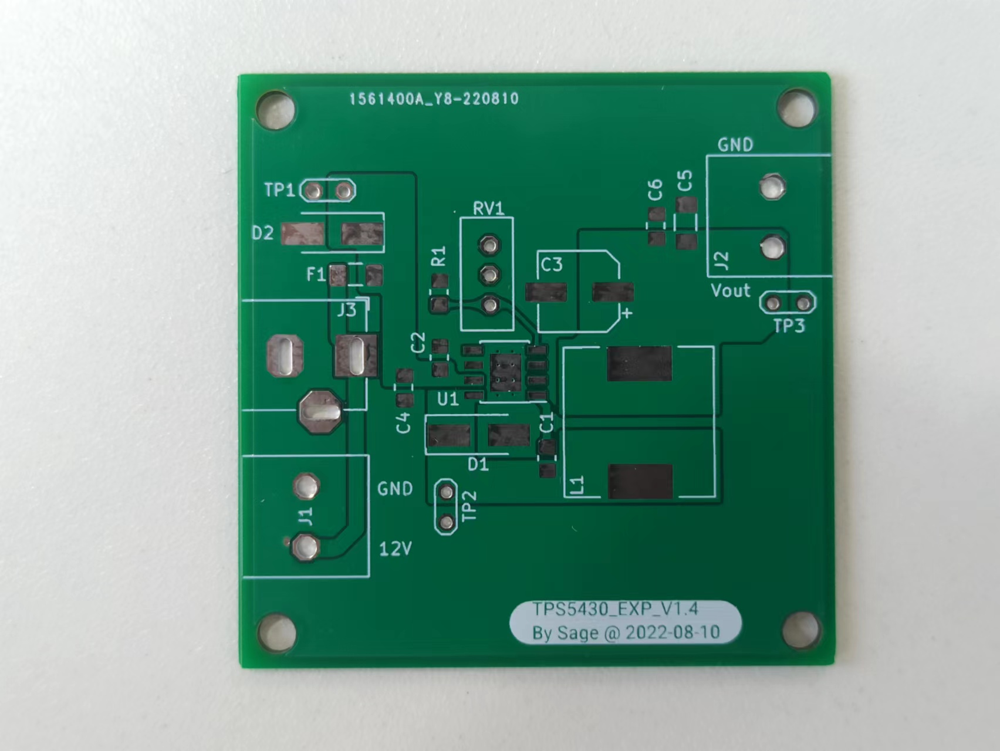

# 项目描述

嵌入式硬件生产制造学习项目，使用 TPS5430 来学习 Buck 电路的 PCB 布线及制作流程。

# 生产软件

KiCAD v6.0.2

# 效果性能

## 1.2 版本

- 修改 TPS5430 电源反馈的采样点

## 1.1 版本

- 完成电源模块基本布线

## 1.4 版本

- 增加输入滤波电容
- 增加输出滤波电容 **MLCC** 和 **钽电容**
- 修改固定输出为可调输出

